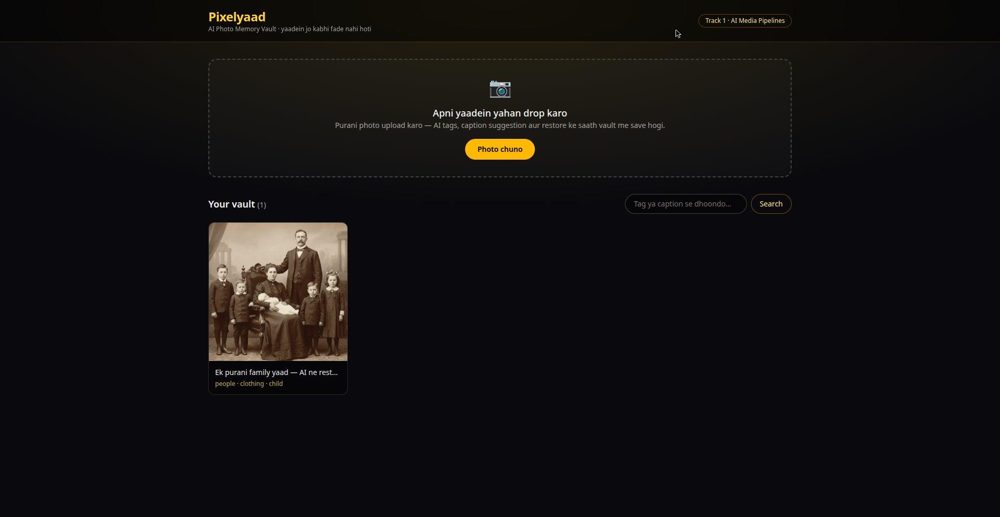
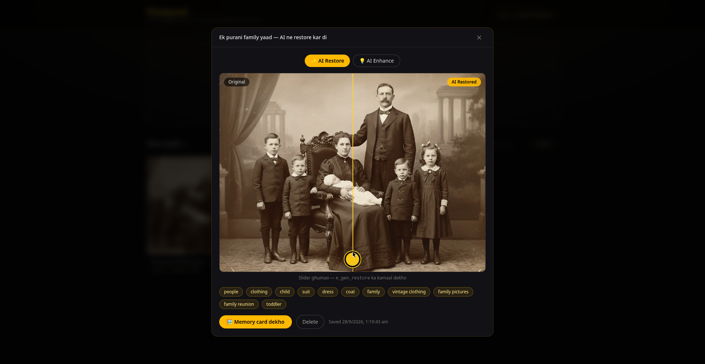
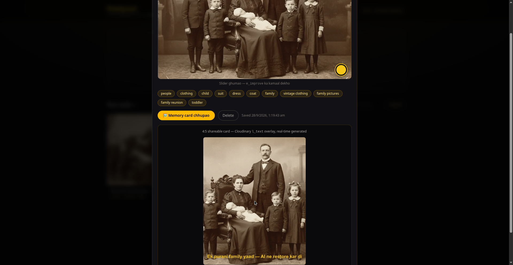

# Pixelyaad — AI Photo Memory Vault

[](https://pixelyaad.onrender.com)
[](https://youtu.be/mWsPBkWTL0M)


**Pixels to Products — Cloudinary AI Hackathon 2026 · Track 1: AI Media Pipelines · Team Pixelyaad**

*Yaadein jo kabhi fade nahi hoti.* Upload your old and family photos — Pixelyaad restores them with AI, auto-tags them, suggests captions (English + हिंदी), and turns them into a searchable memory vault with shareable memory cards **and public share links** for any memory. Every pixel of the magic runs through Cloudinary.

**Team:** Solo — Om ([@devilking7x](https://github.com/devilking7x))

---

## 🔴 Live Demo

**Demo URL:** https://pixelyaad.onrender.com

**Demo video (3:09):** https://youtu.be/mWsPBkWTL0M

Try it: upload any photo → watch the AI tags appear → drag the restore slider → generate a memory card.

## ⚡ Judge quick-start (60 seconds)

1. Open the **live demo** above and drop any photo in.
2. Watch the **AI tags** appear; flip the caption **English ⇄ हिंदी**.
3. Open the photo and drag the **before/after restore slider**.
4. Hit **🔗 Share** → copy the link → open it in an incognito window: a standalone gold memory-card page, no login needed.

## Screenshots

| Gallery | Restore slider | Memory card |
|---|---|---|
|  |  |  |

---

## The problem

Old family photos fade, tear, and get lost in phone galleries. Existing "photo organizer" apps just store files — they don't *understand* what's in the picture, they can't restore a 30-year-old faded print, and searching means scrolling forever. Pixelyaad treats every photo as a memory with a story: AI sees the photo, tags it, captions it, restores it, and makes it findable.

## How Cloudinary powers it (Track 1: AI Media Pipelines)

```
Browser ──unsigned upload (no secret)──▶ Cloudinary
   │                                          │ ▲
   │ metadata only (publicId, tags, caption)  │ │ AI: auto-tagging, e_gen_restore,
   ▼                                          │ │ e_improve, l_text overlays
Express API (atomic JSON store)               │ │
   │                                          ▼ │
   └────────────── Vault UI ◀── public delivery URLs ─┘
```

Media goes in → Cloudinary's AI does something smart automatically → the output is useful. Every row below is live in the app, not a mockup.

| Cloudinary capability | Where it's used |
|---|---|
| **Upload API (unsigned)** | Browser uploads direct to `api.cloudinary.com` via the unsigned `Pixelyaad` preset — no secret in the frontend, no secret on the server |
| **Google Auto Tagging add-on** | Tags come back on the upload response (`dog`, `garden`, …) and are auto-saved with each photo |
| **Generative Restore (`e_gen_restore`)** | Before/after slider in the photo view — faded old photos get AI-restored on the fly |
| **AI Enhance (`e_improve`)** | One-tap enhance toggle next to restore |
| **Transformations API (URL-based)** | Thumbnails (`w_800,c_limit`), optimized delivery (`f_auto,q_auto`) |
| **Text overlays (`l_text`)** | Shareable 4:5 memory cards with a gold caption overlay, generated as a plain image URL |
| **Smart crop (`g_auto`, `c_fill`)** | Memory cards auto-crop to 4:5 around the interesting region |
| **Search (app-level over AI tags)** | Tag + caption search across the vault |

> AI Vision add-on is subscribed on the cloud, but its analyze API needs signed requests, so the app doesn't depend on it — captions are suggested from auto-tags via templates (English + Hindi) and are always editable before saving.

## Features

- 📷 Drag-&-drop / file-picker upload with **live progress bars** (parallel uploads)
- 🏷️ AI tags auto-saved from the upload response; caption **auto-suggested** from tags, English ⇄ हिंदी toggle, fully editable before saving
- 🖼️ Before/after **restore slider** (`e_gen_restore`) + **enhance** toggle (`e_improve`)
- 🔍 Search across tags and captions ("shaadi", "dog", …)
- 🃏 **Memory cards** — 4:5 shareable images with gold caption overlay (WhatsApp/Instagram-ready URL)
- 🔗 **Public share links** — "Share" on any memory → revokable `/share/:token` link opening a standalone gold memory-card page, no login needed
- 🗑️ Delete memories; dark + gold theme; loading skeletons; toasts; mobile-friendly

## Setup

### 1. Cloudinary (free account, ~5 min)

1. Sign up at [cloudinary.com](https://cloudinary.com) (no card needed).
2. **Add-ons** → subscribe to **Google Auto Tagging** (free plan) and **AI Vision** (free plan).
3. **Settings → Upload → Upload presets → Add upload preset**
   - Preset name: `Pixelyaad`
   - Signing Mode: **Unsigned**
   - Save.
4. Note your **cloud name** (dashboard top, "Product Environment Credentials").

### 2. Install & configure

```bash
git clone https://github.com/HackIndiaXYZ/pixels-to-products-cloudinary-ai-hackathon-2026-pixelyaad.git
cd pixels-to-products-cloudinary-ai-hackathon-2026-pixelyaad
```

The demo cloud values are already committed in `web/.env.example` (cloud name + unsigned preset are **public by design** — unsigned uploads expose no secret). For local dev:

```bash
cp web/.env.example web/.env   # already filled: grxcwyre / Pixelyaad
cd web && npm install && cd ../server && npm install
```

> 🔐 **No secrets anywhere.** The app uses only the cloud name + unsigned preset name. The API secret is never needed, never asked for, and must never be committed (`.gitignore` covers `.env` files and `server/data/`).

### 3. Run

```bash
# Terminal 1 — API (http://localhost:4000)
cd server && npm run dev

# Terminal 2 — web (http://localhost:5173, proxies /api → :4000)
cd web && npm run dev
```

### 4. Production build (single server)

```bash
cd web && npm run build
cd ../server && npm run build && npm start   # serves API + web/dist on :4000
```

## How to test

1. **Upload flow:** open the app → drop a photo → watch the progress bar → tags appear → caption is suggested (flip English ⇄ हिंदी) → edit if you like → "Vault me save karo". The photo appears in the gallery with its tags.
2. **Restore:** open a photo → drag the before/after slider (left = original, right = `e_gen_restore`). Toggle ✨ Restore / 💡 Enhance.
3. **Search:** type a tag or caption word in the search box (e.g. `dog`) → matching memories filter instantly.
4. **Memory card:** open a photo → "Memory card dekho" → 4:5 card with gold caption overlay renders from a single Cloudinary URL → "Full size kholo" gives the shareable link.
5. **Share link:** open a photo → "🔗 Share" → "Copy" → open the link in an incognito window → the standalone memory-card page loads with no login. "Share revoke karo" → the link stops working (404).
6. **API smoke test:**
   ```bash
   curl localhost:4000/api/health
   curl -X POST localhost:4000/api/photos \
     -H 'Content-Type: application/json' \
     -d '{"publicId":"sample","tags":["dog","garden"],"caption":"Test yaad"}'
   curl 'localhost:4000/api/photos/search?q=dog'
   ```
   # Share flow:
   # TOKEN=$(curl -s -X POST localhost:4000/api/photos/<id>/share | jq -r .token)
   # curl localhost:4000/api/photos/shared/$TOKEN        # public fields only
   # curl -X DELETE localhost:4000/api/photos/<id>/share # revoke → 404 after
7. **Live Cloudinary check (unsigned upload, no secret):**
   ```bash
   curl -X POST https://api.cloudinary.com/v1_1/grxcwyre/image/upload \
     -F file=@photo.jpg -F upload_preset=Pixelyaad -F tags=pixelyaad
   # → JSON with public_id + auto tags. Restore URL:
   # https://res.cloudinary.com/grxcwyre/image/upload/e_gen_restore,f_auto,q_auto/<public_id>
   ```

## Project structure

```
├── web/                       # Vite + React 18 + Tailwind v4 (dark + gold)
│   ├── src/lib/cloudinary.ts  # URL builders + unsigned upload (fetch + XHR progress)
│   ├── src/lib/captions.ts    # tag → caption templates (English + Hindi)
│   ├── src/lib/api.ts         # typed client for the Express API
│   ├── src/components/        # Dropzone, Gallery, PhotoDetail, SearchBar, ShareView
│   └── .env / .env.example    # PUBLIC: cloud name + unsigned preset only
├── server/                    # Express + TypeScript
│   ├── src/index.ts           # API + serves web/dist in production
│   ├── src/photos.ts          # list / search / create / delete + share / revoke / shared lookup
│   └── src/store.ts           # atomic JSON store (no Cloudinary secret needed)
└── README.md
```

## Hackathon submission checklist

- [x] Cloudinary is core to the product (upload → AI tagging → restore → search → delivery), not just image hosting
- [x] Live demo (deploy URL added at submission time)
- [x] Public repo + setup instructions (this README)
- [x] README explains track, problem, Cloudinary usage, testing
- [x] 2–4 min demo video showing the Cloudinary workflow — [watch on YouTube](https://youtu.be/mWsPBkWTL0M) (3:09)
- [x] Team details (solo — Om, [@devilking7x](https://github.com/devilking7x))
- [x] Cloudinary feedback survey (mandatory — submitted)
- [x] No API keys or credentials in the repo

## License

MIT © 2026 HackIndia — see [LICENSE](LICENSE).
